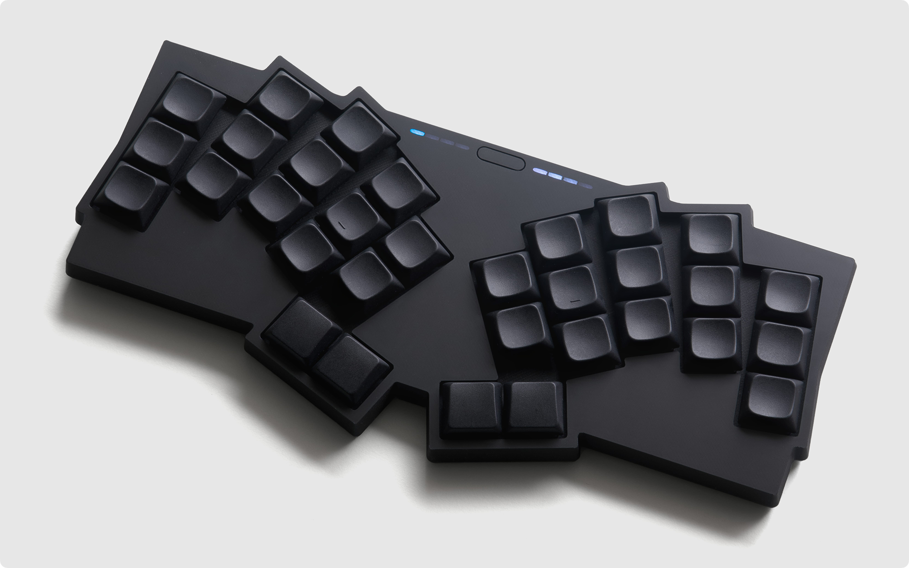
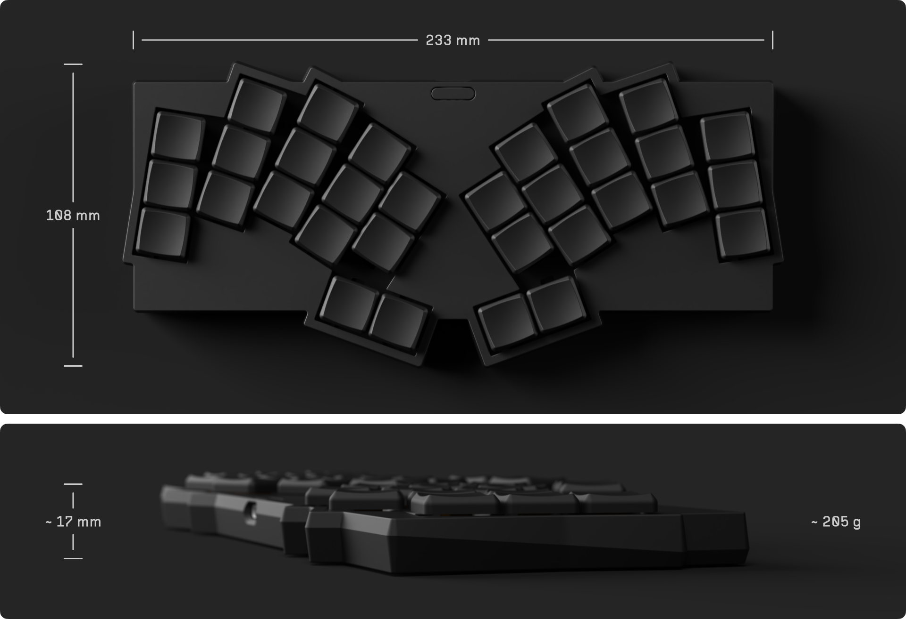

<picture>
  <source media="(prefers-color-scheme: dark)" srcset="./docs/images/visorbearer-heading-dark.png">
  <source media="(prefers-color-scheme: light)" srcset="./docs/images/visorbearer-heading-light.png">
  
</picture>

https://github.com/user-attachments/assets/da893392-b882-4c2d-8c3a-d8bcfd690704

> [!WARNING]
> This is a work in progress.

Visorbearer is a 32-key unibody split wireless keyboard featuring 8 RGB LED indicators, powered by ZMK firmware.

## Design

- 32-key Hummingbird-ish layout with splay and inverted thumb cluster
   - Down to 26-key with case and plate variants
- 2x 4-segment RGB LED indicators
   - Discreet dead-front design: completely invisible when off
   - Connection bar: Bluetooth profiles and modifier keys
   - Battery bar: percentage and charging status
   - Powered by two TI LP5012 drivers with automatic low-power mode
- Hot-swap Kailh Choc v1 switches in Choc (18x17mm) spacing
   - 
 
Limited support for Choc v2

      The PCB is incompatible with older Choc v2 switches that have a third stabilizing pin. Newer Choc v2 releases without this pin work fine, such as: Lofree POM Phantom/Ghost/Specter/Hades and Kailh Hide Mountain/White Rain/Deep Sea Mini Islet/Deep Sea Mini Whale. Note that choc-spaced keycaps with MX stems are not commercially available, so you'll be limited to 3D-printed keycaps for Choc v2 switches.
   

- Seeed Studio XIAO nRF52840 **Plus** controller on ZMK firmware
- 3D-printed case and switch plate with switch puller grooves
   - Easily accessible reset button

<picture>
  <source media="(prefers-color-scheme: dark)" srcset="./docs/images/visorbearer-dimensions-dark.png">
  <source media="(prefers-color-scheme: light)" srcset="./docs/images/visorbearer-dimensions-light.png">
  
</picture>

## Build Guide

> [!WARNING]
> Revision 2 PCB has not been tested yet.

## Acknowledgments

- Aesthetics
   - [GEIGEIGEIST/TOTEM](https://github.com/GEIGEIGEIST/TOTEM)
   - [weteor/Grumpy](https://github.com/weteor/Grumpy)
- Layout
   - [bennytrouser/NostrumX](https://github.com/bennytrouser/NostrumX)
   - [davidphilipbarr/hypergolic](https://github.com/davidphilipbarr/hypergolic)
   - [davidphilipbarr/paroxysm](https://github.com/davidphilipbarr/paroxysm)
   - [grassfedreeve/akohekohe](https://github.com/grassfedreeve/akohekohe)
   - [hazels-garage/bad-wings](https://github.com/hazels-garage/bad-wings/tree/master/v2)
   - [kilipan/zilpzalp](https://github.com/kilipan/zilpzalp)
   - [weteor/Fitis](https://github.com/weteor/Fitis)
   - [weteor/Tipper-TF](https://github.com/weteor/Tipper-TF)
- LED indicator
   - [GEIGEIGEIST/KLOTZ](https://github.com/GEIGEIGEIST/KLOTZ)
   - [caksoylar/zmk-rgbled-widget](https://github.com/caksoylar/zmk-rgbled-widget): LED code
- Case
   - [duckyb/urchin](https://github.com/duckyb/urchin): Snap fit design
- And the lovely folks on the Fingerpunch discord who were along for the ride!
