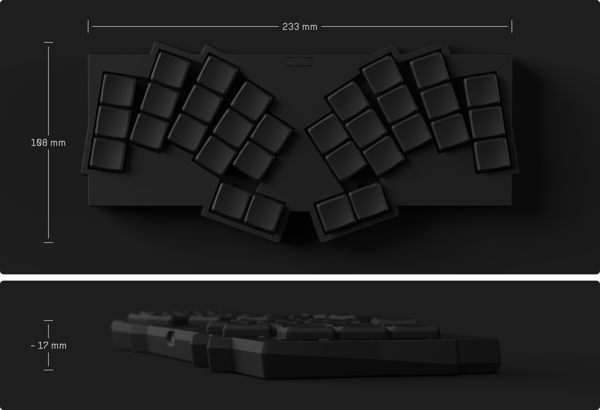

# Visorbearer

## Design

- 32-key Hummingbird-ish layout with splay and inverted thumb cluster
- Discreet 2x 4-segment RGB LED indicators
   - Connection bar: Bluetooth profiles and modifier keys
   - Battery bar: percentage and charging status
   - Powered by two TI LP5012 drivers with low-power mode
- Hot-swap Kailh Choc V1 (V2 with caveats[^1]) switches in Choc (18x17mm) spacing
- Seeed Studio XIAO nRF52840 **Plus** controller on ZMK firmware
- 3D-printed case and switch plate with switch puller grooves

[^1]: There is no choc-spaced but MX-stemmed keycap available off the shelf, so you will need to 3D print keycaps for Choc v2. The PCB is also not compatible with earlier Choc v2 switches that have an extra third stabilizing pin. More recent releases (including but not limited to: Lofree Phantom/Ghost/Specter/Hades, Kailh Hide Mountain/White Rain/Deep Sea Mini Islet/Deep Sea Mini Whale) omit the third pin and are compatible.

<picture>
  <source media="(prefers-color-scheme: dark)" srcset="docs/images/visorbearer_dimensions_dark.png">
  <source media="(prefers-color-scheme: light)" srcset="docs/images/visorbearer_dimensions_light.png">
  
</picture>

## Credits

- Aesthetics
   - [GEIGEIGEIST/TOTEM](https://github.com/GEIGEIGEIST/TOTEM)
   - [weteor/Grumpy](https://github.com/weteor/Grumpy)
- Layout
   - [bennytrouser/NostrumX](https://github.com/bennytrouser/NostrumX)
   - [davidphilipbarr/hypergolic](https://github.com/davidphilipbarr/hypergolic)
   - [davidphilipbarr/paroxysm](https://github.com/davidphilipbarr/paroxysm)