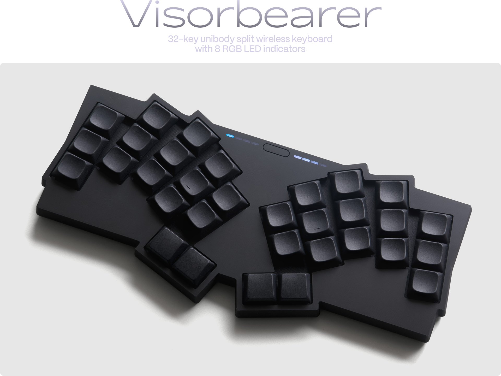
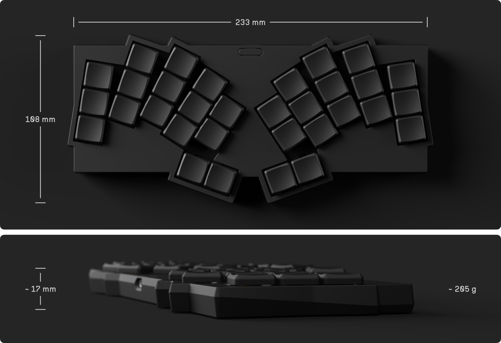
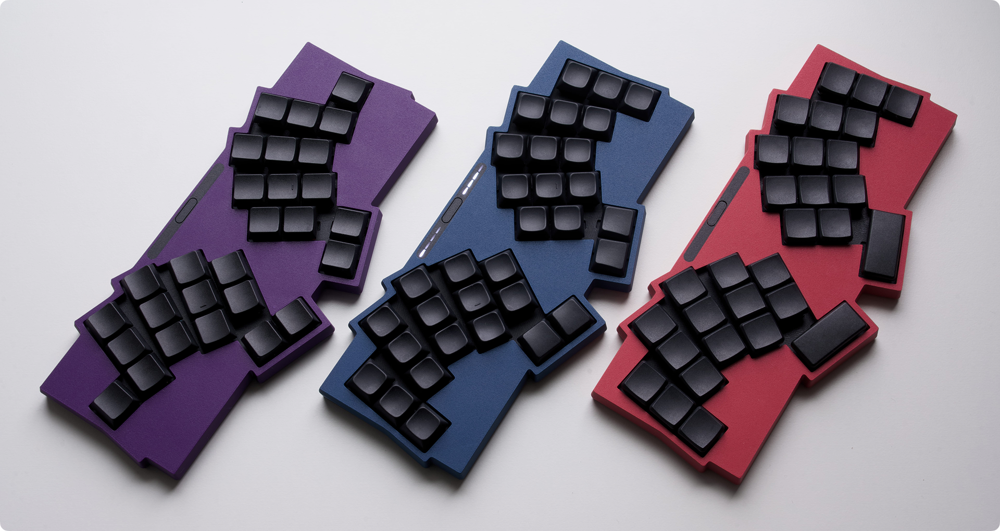

# Visorbearer

Visorbearer is a 32-key unibody split wireless keyboard featuring 8 RGB LED indicators.

Named after [hummingbirds in the genus Augastes](https://en.wikipedia.org/wiki/Visorbearer) for the Hummingbird layout connection and distinctive white bands on their chests that resemble the LED indicators.

> [!WARNING]
> This is a work in progress.

## To-Do

- [ ] Build Guide & BOM
- [ ] Case Printing Guide
- [ ] Alternative layout case files and guide
- [x] Revision 2 PCB testing + power profiling
- [x] Firmware Notes
- [ ] Design write-up
- [ ] More photos

## Design

https://github.com/user-attachments/assets/812049e3-29ce-48d4-8fe3-20bf21285e64

- 2x 4-segment RGB LED indicators
   - Discreet dead-front design: completely invisible when off
   - Connection bar: Bluetooth profiles and modifier keys
   - Battery bar: percentage and charging status
   - Powered by two TI LP5012 drivers with automatic low-power mode
- 32-key Hummingbird-ish layout with splay and inverted thumb cluster
   - Down to 26-key with case and plate variants
      - 2U thumb key support
- Hot-swap Kailh Choc v1 switches in Choc (18x17mm) spacing
   - 
 
Limited Choc v2 compatibility

      The PCB is incompatible with older Choc v2 switches that have a third stabilizing pin. Newer Choc v2 releases without this pin work fine, such as: Lofree POM Phantom/Ghost/Specter/Hades and Kailh Hide Mountain/White Rain/Deep Sea Mini Islet/Deep Sea Mini Whale.

      Note that, for Choc v2, there are very few off-the-shelf options for choc-spaced keycaps with MX stems: as of late 2025, the only two are [Taihao THCS](https://shop.tai-hao.com/categories/thcs-low-profile-keycaps) and [Asymplex MX-stem Chicago Steno](https://www.asymplex.xyz/product/made-to-order-mx-stem-cs-kits). You could also 3D-print your own keycaps.

   

- Seeed Studio XIAO nRF52840 **Plus** controller on ZMK firmware
- 3D-printed case and switch plate with switch puller grooves
   - Easily accessible reset button

<picture>
  <source media="(prefers-color-scheme: dark)" srcset="./docs/images/visorbearer-dimensions-dark.png">
  <source media="(prefers-color-scheme: light)" srcset="./docs/images/visorbearer-dimensions-light.png">
  
</picture>

## Build Guide

> [!NOTE]
> Revision 2 PCB is tested and working. Build guide is work in progress.

[View the PCB on KiCanvas.](https://kicanvas.org/?github=https%3A%2F%2Fgithub.com%2Fcarrefinho%2Fvisorbearer%2Ftree%2Fmain%2Fvisorbearer-pcb)

[Find the build guide here.](/docs/build-guide.md)

## Firmware

[Find the ZMK module here.](https://github.com/carrefinho/visorbearer-zmk-module)

## Gallery

## Inspirations & Acknowledgments

- Aesthetics
   - [GEIGEIGEIST/TOTEM](https://github.com/GEIGEIGEIST/TOTEM)
   - [weteor/Grumpy](https://github.com/weteor/Grumpy)
   - [dohn-joh/alias](https://github.com/dohn-joh/alias)
- Layout
   - [bennytrouser/NostrumX](https://github.com/bennytrouser/NostrumX)
   - [davidphilipbarr/hypergolic](https://github.com/davidphilipbarr/hypergolic)
   - [davidphilipbarr/paroxysm](https://github.com/davidphilipbarr/paroxysm)
   - [grassfedreeve/akohekohe](https://github.com/grassfedreeve/akohekohe)
   - [hazels-garage/bad-wings](https://github.com/hazels-garage/bad-wings/tree/master/v2)
   - [kilipan/zilpzalp](https://github.com/kilipan/zilpzalp)
   - [weteor/Fitis](https://github.com/weteor/Fitis)
   - [weteor/Tipper-TF](https://github.com/weteor/Tipper-TF)
- LED indicator
   - [GEIGEIGEIST/KLOTZ](https://github.com/GEIGEIGEIST/KLOTZ)
   - [caksoylar/zmk-rgbled-widget](https://github.com/caksoylar/zmk-rgbled-widget): LED code
- Case
   - [duckyb/urchin](https://github.com/duckyb/urchin): Snap fit design
- And the lovely folks on the Fingerpunch discord who were along for the ride!

## License

Visorbearer is licensed under CERN-OHL-P-2.0.
