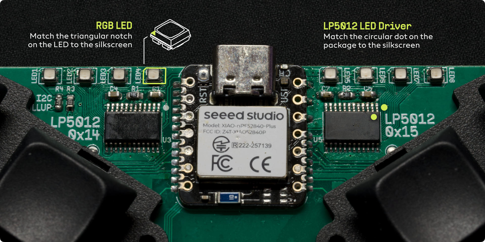

# PCB Assembly Guide

> [!WARNING]
> The Visorbearer PCB uses fine-pitch SMD components, so it’s better suited to builders with some surface-mount soldering experience.

> [!TIP]
> My personal approach is to use a mixture of drag soldering for the LED drivers and XIAO, and paste with hot plate for LEDs and passives.

## PCB Bill of Materials

| Qty | Reference(s) | Part number | Notes and links |
| --- | --- | --- | --- |
| 1 | U1 | Seeed Studio XIAO nRF52840 **Plus**  | **Plus** variant only https://www.seeedstudio.com/Seeed-Studio-XIAO-nRF52840-Plus-p-6359.html |
| 2 | U3, U5 | LP5012PWR | TSSOP24 RGB LED driver https://www.mouser.com/ProductDetail/Texas-Instruments/LP5012PWR?qs=T94vaHKWudSL6jLwBy12Hg%3D%3D |
| 8 | LED1–LED8 | CLMVC-FKC-CGJJM569aBB7a343 | PLCC4 RGB LED https://www.mouser.com/ProductDetail/941-CLMVG569ABB7A343 any CLMVC-FKC LED will work; CGJJM569aBB7a343 is one specific bin |
| 4 | C1, C4, C5, C7 | CL10A105KB8NNNC | 1 µF 25V X5R 0603 multilayer ceramic capacitor https://www.mouser.com/ProductDetail/Samsung-Electro-Mechanics/CL10A105KA8NNNC?qs=hqM3L16%252BxldY%252BnK4KzDJVg%3D%3D Decoupling caps for LED drivers |
| 2 | R1, R2 | ERA-3AEB153V | 15 kΩ 0603 thin-film resistor https://www.mouser.com/ProductDetail/Panasonic/ERA-3AEB153V?qs=1VWA5LkbEap3wo6XEtDQIA%3D%3D LED current reference resistor for LED drivers |
| 2 | R3, R4 | ERA-3AEB472V | 4.7 kΩ 0603 thin-film resistor https://www.mouser.com/ProductDetail/Panasonic/ERA-3AEB472V?qs=1VWA5LkbEaqNFnF6JmW5eg%3D%3D I²C pull-up resistors |
| 16 | D1–D16 | BAV70 | SOT-23 Dual switching diode https://www.mouser.com/ProductDetail/637-BAV70 |
| 34 | CH1–CH34 | CPG135001S30 | Kailh Choc hot-swap sockets |
| 1 | - | 801735 | 400mAh Lithium polymer battery https://www.adafruit.com/product/3898 802030 400mAh and 601230 200mAh are also good options. The common 301230 110mAh works too but you might want a bit of double sided tape to fix the battery to the case. |

[View an interactive version of the BOM here](https://htmlpreview.github.io/?https://github.com/carrefinho/visorbearer/blob/main/visorbearer-pcb/bom/ibom.html).

## Component Placement

